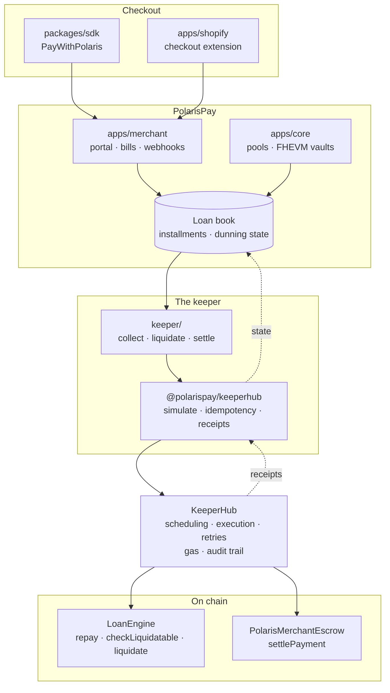
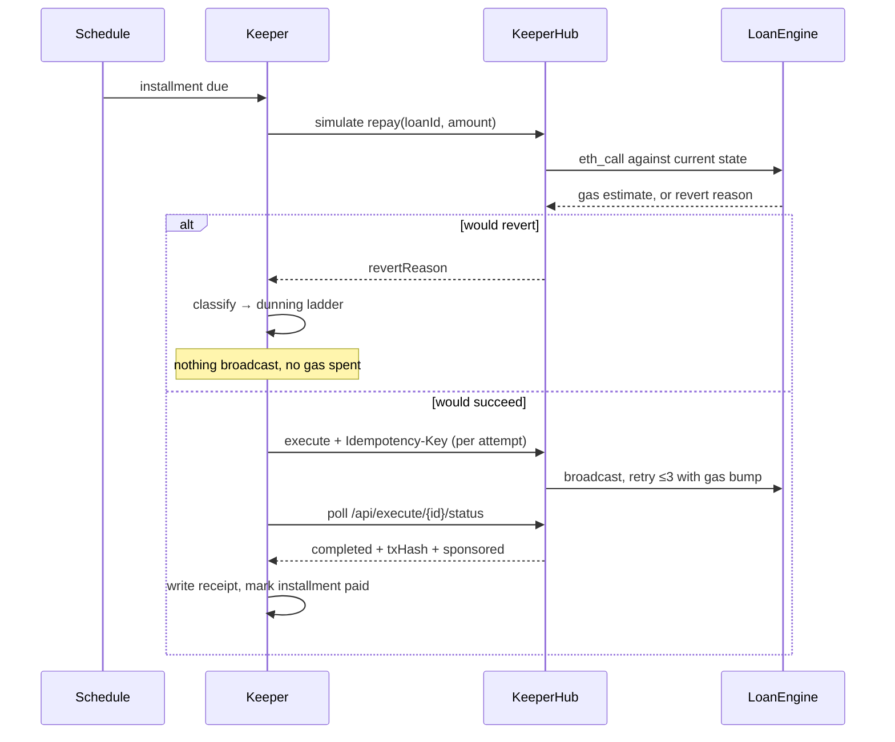

# Architecture

## The shape of the system

Polaris is a hub-and-spoke credit protocol. Credit logic — pools, loans, scores, repayments — lives on a hub. Liquidity sits in `LiquidityVault` contracts on spoke chains. Users build a FICO-style score (300–850) through repayment behaviour, and that score drives how much credit they can draw.

PolarisPay is the payments product on top: checkout, BNPL, merchant settlement. **The keeper is what connects a credit decision to a transaction that is actually mined.**



Everything that touches a chain goes through one path: `PolarisKeeper` → `KeeperHubClient` → KeeperHub. There is no second way to move money, which is what makes the guarantees below enforceable rather than aspirational.

## The collection path



The branch at the top is the whole point. Without simulation, discovering that a borrower is short costs a failed transaction and a gas fee, every time, for every short borrower. With it, that discovery is free and becomes a dunning event instead.

## The liquidation path

Liquidation is a race. Every keeper watching the same protocol sees the same opportunity, and the naive implementation — read the health factor, decide, then write — loses that race and occasionally liquidates a loan that was repaid in the gap.

`check-and-execute` closes the gap: the read, the comparison and the write happen inside one KeeperHub call.

```
checkLiquidatable(loanId) == true  →  liquidate(loanId)
```

A healthy loan returns `{ executed: false }`, costs nothing, and sends nothing. The keeper records it as `skipped` so the run log shows coverage rather than silence.

## Failure taxonomy

Failures are classified by cause, because the right response differs completely:

| Cause | Response | Reasoning |
|---|---|---|
| `insufficient_funds` | Dunning ladder: 6h → 24h → 72h → 168h, then escalate | The borrower is short. Only time helps. |
| `would_revert` | Abandon, flag for reconciliation | Protocol state rejected it — loan closed, already repaid, stale amount. Retrying cannot fix it. |
| `auth`, `spend_cap` | Abandon, alert the operator | Our misconfiguration. Never dun a customer for it. |
| `rate_limit`, `timeout`, `server` | Transport already retried with backoff | Transient. |
| Ladder exhausted | Mark as liquidation candidate | Collection has run out of road. |

## Data flow into the loan book

The loan book is the keeper's working state: which installments exist, when they are due, how many attempts each has had, and when the next attempt is allowed. `LoanBook` is a narrow interface with a file-backed implementation so the keeper runs end to end with no database; production swaps in the Supabase store the Polaris apps already use.

The dunning back-off lives here rather than in the client, because it is a business schedule and not a network one — a borrower who was short an hour ago is probably still short, and re-charging burns rate limit for nothing.

## Where the FHEVM side fits

`apps/core` carries the confidential track: private collateral vaults, private borrow manager, private liquidation engine. Encrypted credit state and a keeper that must evaluate a liquidation condition on chain are in tension — a keeper cannot branch on a value it cannot read.

The resolution in this design is that the *condition* is evaluated inside the contract (`checkLiquidatable` returns a plain boolean) while the *inputs* to that condition stay encrypted. KeeperHub only ever sees the boolean. This keeps the confidential model intact without the keeper needing a decryption path.

## Design decisions

**One execution path.** Every charge, liquidation and settlement goes through `PolarisKeeper`. Guarantees enforced in one place are guarantees; guarantees enforced in five places are suggestions.

**Simulate before every write.** Cheap, and it converts the most common failure from a cost into information.

**Per-attempt idempotency keys.** See the README. The short version: KeeperHub caches failures too, so a stable key makes recovery impossible.

**Receipts are first-class.** Not logging — a typed record joining the KeeperHub execution to the loan and installment it belongs to, so a dispute can be answered without a KeeperHub login.

**The keeper never crashes on a bad pass.** A failing pass is caught and the loop continues; the next pass re-reads state and everything in flight is idempotent.
